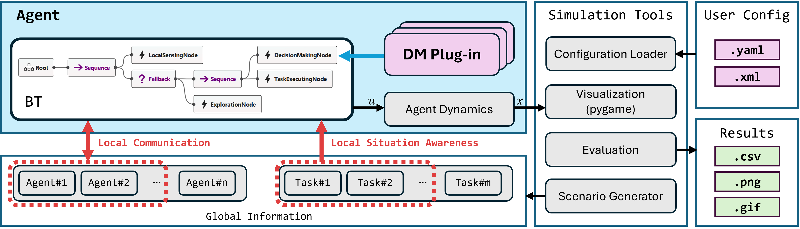

**********************
Simulator Architecture
**********************

        **Figure 1:** Software Architecture

        

The main components of the simulator's code are as follows: **behavior tree**, **agent**, **decision-making plugin**, **task**, and **util**.

==============

Behavior Tree (``/module/behavior_tree.py``)
----------------------------------------------------

The SPADE simulator, developed using `pygame <https://www.pygame.org/>`_, utilizes behavior trees for agent operations due to their modularity and flexibility. Each agent’s behavior tree is executed from the root during every game loop iteration. The simulation frame rate should be adjusted based on the actual computation times of behavior trees to ensure realistic simulation.

In the default behavior tree, agents start with the `LocalSensingNode` to detect nearby tasks and messages. They then proceed to the `DecisionMakingNode` for task assignments, followed by the `TaskExecutionNode` to perform the task. If no tasks are detected, the agent executes the `ExplorationNode` to move to a random position and search for tasks.

A behavior tree for the SPADE simulator can be defined by `Groot2 <https://www.behaviortree.dev/groot>`_, a GUI tool for `BehaviorTree.CPP <https://www.behaviortree.dev/>`_, enabling easy visualization and modification of agent behaviors.

Our behavior tree implementation supports control nodes (e.g., `Sequence`, `Fallback`) and action nodes (e.g., `DecisionMakingNode`, `TaskExecutionNode`, `ExplorationNode`, `LocalSensingNode`). Action nodes exchange information via a `blackboard` mechanism. Users can extend functionality by adding custom action nodes and its detailed tutorial is available in :doc:`Adding a Custom Behavior Tree <tutorials/tutorial_bt>`. 

==============

Agent (``/module/agent.py``)
----------------------------------------------------

The `Agent` class is fundamental to the simulator, encapsulating essential attributes and functionalities for each agent. Each agent maintains key attributes such as identification number, position, velocity, acceleration, and rotation. It also has mobility attributes, including maximum linear speed, maximum angular speed, and maximum acceleration. Additionally, the agent's work rate specifies how much task workload it can handle per second.

**Local Communication Capabilities**: Agents are equipped with features for local communication and perception. The communication range defines how far an agent can interact with its neighbors, while the situational awareness range determines how far the agent can detect nearby tasks. 

**Movement and Task Execution**: Agents are modeled as point masses that move directly toward their assigned tasks. Task execution is handled through the `TaskExecutingNode` in the behavior tree. 

==============

Decision-making Plug-in  (``/plugins/..``)
----------------------------------------------------

The SPACE simulator allows users to switch decision-making algorithms by simply modifying the ``config.yaml`` file, treating it as a plugin (see :doc:`Setting config.yaml <tutorials/tutorial_config>`). 

Currently, some decision-making plugins are implemented such as CBBA and GRAPE (see :doc:`Decision-Making Plugins <plugin_index>`).

Users have the flexibility to implement custom decision-making algorithms as separate Python plugins (see :doc:`Adding a Custom Plugin <tutorials/tutorial_plugin>`).

==============

Task (``/module/task.py``)
----------------------------------------------------

The `Task` class is responsible for managing attributes related to tasks, including identification number, position, and workload. 

==============

Utilities (``/module/utils.py``)
----------------------------------------------------

**Simulation Metrics and Output**: Upon the completion of a simulation, the SPADE simulator records key metrics such as the distance traveled and the workload completed by each agent. These metrics are captured both as a time-wise summary and as individual agent-level data, all of which are saved in CSV files for detailed analysis.

**Testing Modes**: The simulator supports two testing modes: screen rendering and non-rendering. In screen rendering mode, the simulation is visualized using `pygame`, and the visual output can optionally be saved as a GIF. This allows users to review the simulation visually and capture dynamic elements of the simulation process.

**Monte Carlo Experiments**: Users can configure scenarios by specifying parameters such as decision-making plugins, agent settings, and task settings in a ``config.yaml`` file. Multiple configurations can be prepared for different parametric studies. Then, users can also define a set of configurations in a separate YAML file and specify the number of Monte Carlo runs for each scenario. The simulator then automatically executes these tests according to the provided parameters, facilitating Monte Carlo experiments (see :doc:`Conducting Monte Carlo Tests <tutorials/tutorial_monte_carlo>`).

