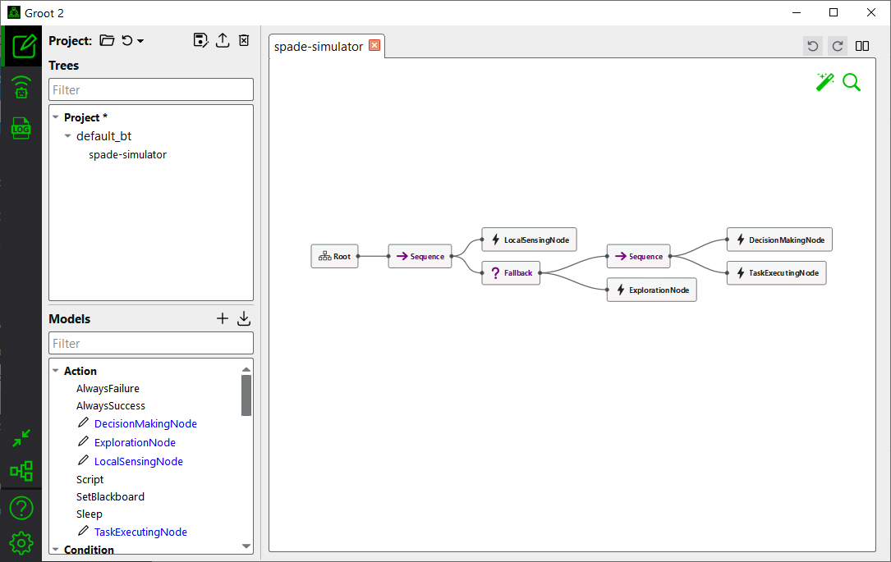
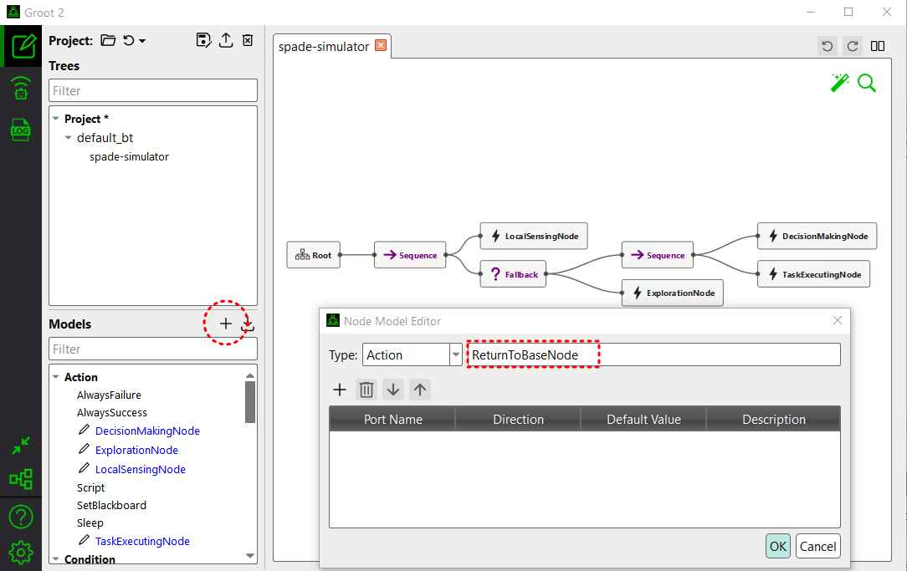
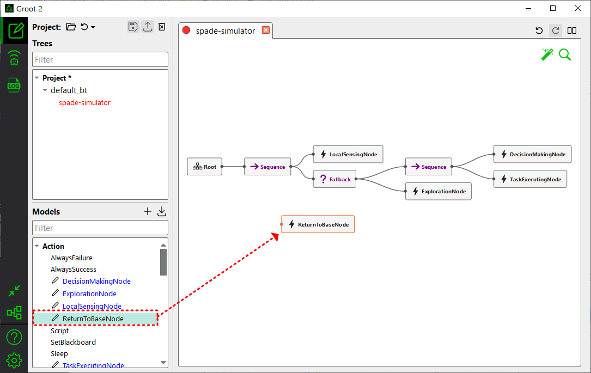
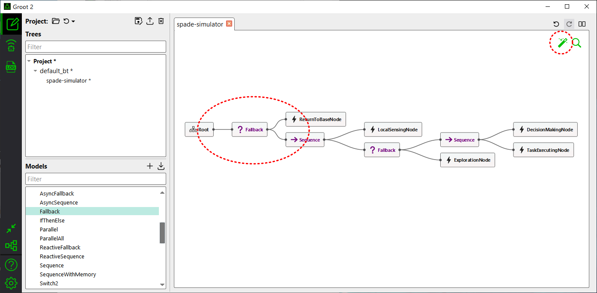

.. _tutorial_custom_bt:

Adding a Custom Behavior Tree
*******************************

**Prerequisite**: :ref:`tutorial_basic_use`

.. contents:: Table of Contents

--------------------

Opening the Default Behavior Tree with Groot2
=============================================

Let's open the currently defined default behavior tree using Groot2. First, download Groot2 (https://www.behaviortree.dev/groot/), which is actually a GUI tool created for ``BehaviorTree.CPP``. Run Groot2 and open ``/bt_xml/default_bt.xml``. You will then be able to visualize the default behavior tree as shown below.

    **Figure 1:** Groot2 with ``default_bt.xml``
 

.. note::

   Groot2 was originally created for ``BehaviorTree.CPP``, but in the SPACE simulator, only the visualization functionality of the Behavior Tree is used. Therefore, the other features do not work.

In the default behavior tree (i.e., ``/bt_xml/default_bt.xml``), agents start with the ``LocalSensingNode`` to detect nearby tasks and messages. They then proceed to the ``DecisionMakingNode`` for task assignments, followed by the ``TaskExecutionNode`` to perform the task. If no tasks are detected, the agent executes the ``ExplorationNode`` to move to a random position and search for tasks.

You can observe this behavior by following the tutorial in :ref:`tutorial_basic_use`, and its simulation result will be similar to the following. 

.. figure:: result/FirstClaimGreedy_a10_t100_2024-08-20_19-08-36.gif
   :width: 95%
   :align: center

   **Figure 2:** Simulation Visualization 

------------------

Step 1 - Creating BT Nodes in Groot2
=============================================

In this tutorial, based on the setting of :ref:`tutorial_basic_use`, we will attempt to modify the behavior tree for another scenario. 

Consider a delivery drone scenario. There is a depot located at a specific position, and each drone needs to visit a destination to deliver a package. After completing the delivery, the drone should return to the depot and then proceed to a new task. 

To implement this modification, let's add a new BT (Behavior Tree) node called ``ReturnToBaseNode`` in the existing behavior tree. Using Groot2, click the ``+`` button to add a new BT node, and then enter ``ReturnToBaseNode`` as the node name.

   **Figure 3:** Creating a new node

You should then see ``ReturnToBaseNode`` appear in the left `Models` pane. Click on it and drag-and-drop it onto the canvas.

   **Figure 4:** Drag-and-drop the node

---------------------------

Step 2 - Construct a Behavior Tree
===================================

Now, we are creating a behavior tree to model the desired behavior using BT nodes.

In the drone delivery scenario, each agent should go to the base after completing a task. There are various ways to implement this as a behavior tree, but let’s proceed with the following approach:

1. First, place the ``ReturnToBaseNode`` node at the beginning of the BT.

2. Consider the logic that will run inside the ``ReturnToBaseNode`` node as follows: At the beginning of the BT, ``ReturnToBaseNode`` should check if the assigned task has been completed. If it has, the node will move the agent to the base. If the task is not completed, ``ReturnToBaseNode`` will return a ``FAILURE`` status to its parent, allowing the rest of the BT to continue running. To achieve this, connect the ``ReturnToBaseNode`` node to the rest of the BT using a ``Fallback`` node.

To configure the BT, simply drag-and-drop the nodes to position them. Connect the nodes by clicking on the circles on each node's side and linking them to other nodes as necessary. The modified behavior tree will look as follows.

   **Figure 5:** The modified behavior tree

.. note::

   If you click the magic wand button in the top-right corner of Groot2, the BT nodes will be automatically rearranged.

Next, save the modified behavior tree as ``/bt_xml/new_bt.xml``.

You can download the file: :download:`new_bt.xml <custom_bt/new_bt.xml>`.

---------------------------

Step 3 - Implement the New BT Nodes in ``modules/behavior_tree.py``
====================================================================

The next step is to implement the newly created ``ReturnToBaseNode`` node as a Python class in ``modules/behavior_tree.py``.

Technically, nodes like ``ReturnToBaseNode`` are known as BT action nodes. In the current version of the simulator, BT action nodes such as ``DecisionMakingNode``, ``TaskExecutionNode``, ``ExplorationNode``, and ``LocalSensingNode`` are already implemented. You should refer to these BT action nodes when implementing the ``ReturnToBaseNode`` node.

The basic structure of a BT action node is as follows:

.. code-block:: python

    class NewActionNode(SyncAction):
        def __init__(self, name, agent):
            super().__init__(name, self._new_action)
            # Implement any initialization

        def _new_action(self, agent, blackboard):        
            # Implement any behavior

            return Status.SUCCESS # or Status.FAILURE

As described in Step 2, ``ReturnToBaseNode`` node will be implemented such that:

(1) The agent moves to the base if the task is completed. 
(2) If the task is not completed, the node will return ``FAILURE`` to allow the rest of the BT to continue. 

For example, we can implement as follows:

.. code-block:: python

    class ReturnToBaseNode(SyncAction):
        def __init__(self, name, agent):
            super().__init__(name, self._return_to_base)
            self.return_to_base_mode = False
            self.depot_pos = pygame.Vector2(700,500)

        def _return_to_base(self, agent, blackboard):
            # Check if the assigned task is completed
            if agent.assigned_task_id is not None and agent.tasks_info[agent.assigned_task_id].completed:             
                self.return_to_base_mode = True
            
            # Move to the base if the task is completed
            if self.return_to_base_mode:            
                distance_to_base = (self.depot_pos - agent.position).length()
                if distance_to_base > target_arrive_threshold: 
                    agent.follow(self.depot_pos)
                    return Status.SUCCESS
                
                self.return_to_base_mode = False
                
            # If the task is not completed, return ``FAILURE`` to allow the rest of the BT to continue
            return Status.FAILURE

For more details of each line, please refer to :ref:`api_reference`. 

Next, add the newly created action node to the ``BehaviorTreeList`` class at the top of ``behavior_tree.py``.

.. code-block:: python

    class BehaviorTreeList:
        CONTROL_NODES = [        
            'Sequence',
            'Fallback'
        ]

        ACTION_NODES = [
            'LocalSensingNode',
            'DecisionMakingNode',
            'TaskExecutingNode',
            'ExplorationNode',
            'ReturnToBaseNode'  # Added
        ]

You can download the modified file: :download:`behavior_tree.py <custom_bt/behavior_tree.py>`.

---------------------------

Step 4 - Modify the `config.yaml` Settings
==========================================

Update the following section in the existing configuration file:

.. code-block:: yaml

    agents:
      behavior_tree_xml: new_bt.xml # Was default_bt.xml
      ...
      situation_awareness_radius: 0 # Was 500

In this scenario, let's assume that the agents have full awareness of all tasks within the environment. Since the scenario has been modified to require agents to return to the base before moving to a new task, agents might otherwise fail to detect tasks that are far away. For this, set the ``situation_awareness_radius`` to ``0`` (see :ref:`configuration_guide` for more information).

Then, save the file as ``config_greedy_rtb.yaml``.

You can download the modified file: :download:`config_greedy_rtb.yaml <custom_bt/config_greedy_rtb.yaml>`.

--------------------------

Run the Simulation
==================

Now, let's execute the simulation with the following command:

.. code-block:: bash

    python main.py --config=config_greedy_rtb.yaml

Then, you will see a simulation similar to the following.

.. figure:: custom_bt/result/FirstClaimGreedy_a10_t100_2024-08-23_23-25-33.gif
    :width: 95%
    :align: center

    **Figure 6:** Simulation Visualization with ``ReturnToBaseNode``
