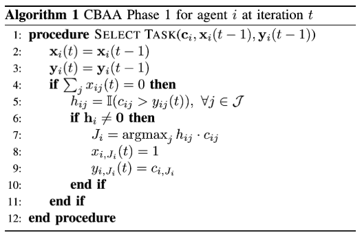
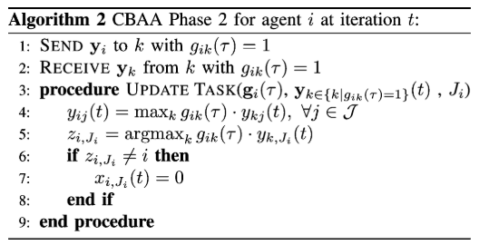

.. _tutorial_custom_plugin:

Adding a Custom Plugin
***********************

**Prerequisite**: :ref:`tutorial_custom_bt`

.. contents:: Table of Contents

.. note:: This tutorial is more advanced. It is recommended to complete :ref:`tutorial_custom_bt` and frequently refer to the :ref:`api_reference`.

Recommended Structure 
==============================

Decentralized decision-making algorithms typically operate based on local information, such as nearby tasks and agents. This information is gathered by the ``LocalSensingNode`` and stored in the blackboard.

The ``LocalSensingNode`` class is structured as follows:

.. code-block:: python

    class LocalSensingNode(SyncAction):
        def __init__(self, name, agent):
            super().__init__(name, self._local_sensing)

        def _local_sensing(self, agent, blackboard):
            blackboard['local_tasks_info'] = agent.get_tasks_nearby(with_completed_task=False)
            blackboard['local_agents_info'] = agent.local_message_receive()
            return Status.SUCCESS

Therefore, the decision-making plugin should start by retrieving the local information from the blackboard (assuming the use of ``default_bt.xml``).

Below is a basic skeleton for a decision-making plugin:

.. code-block:: python

    class MyDecisionMakingClass:
        def __init__(self, agent):
            self.agent = agent
            self.assigned_task = None
            self.satisfied = False  # Rename if necessary
            # Define any additional variables if needed

        def decide(self, blackboard):
            '''
            Output:
                - `task_id` if task allocation is successful
                - `None` otherwise
            '''
            # Retrieve local information from the blackboard
            local_tasks_info = blackboard['local_tasks_info']
            local_agents_info = blackboard['local_agents_info']

            # Check if the previously assigned task is completed
            if self.assigned_task is not None and self.assigned_task.completed:
                # Implement your logic here
                pass

            # Exit if there are no tasks nearby
            if len(local_tasks_info) == 0:
                return None

            # Perform local decision-making
            if not self.satisfied:
                # Implement your decision-making logic here

                # Broadcasting
                self.agent.message_to_share = {
                    # Implement your data sharing logic here
                }
                self.satisfied = True
                return None

            # Conflict resolution
            if self.satisfied:
                # Implement your conflict resolution logic here
                pass
                return self.assigned_task.task_id if self.assigned_task is not None else None

The ``DecisionMakingNode`` class wraps this decision-making plugin as a BT action node. As shown below, the node retrieves the ``assigned_task_id`` from the plugin and stores it in the blackboard, which the ``TaskExecutionNode`` then uses. The node returns ``SUCCESS`` if a task is assigned, otherwise ``FAILURE``.

.. code-block:: python

    class DecisionMakingNode(SyncAction):
        def __init__(self, name, agent):
            super().__init__(name, self._decide)
            self.decision_maker = MyDecisionMakingClass(agent)

        def _decide(self, agent, blackboard):
            assigned_task_id = self.decision_maker.decide(blackboard)
            agent.set_assigned_task_id(assigned_task_id)
            blackboard['assigned_task_id'] = assigned_task_id
            if assigned_task_id is None:
                return Status.FAILURE
            else:
                return Status.SUCCESS

When creating a plugin, ensure that it returns either an assigned task ID or ``None``.

-------------------------------------------------

Example: CBAA
=============

Let's implement the `CBAA (Consensus-Based Auction Algorithm)` based on the pseudocode from the paper, `H. Choi, L. Brunet, J.P. How, "Consensus-Based Decentralized Auctions for Robust Task Allocation", IEEE Transactions on Robotics, 25(4), 2009, pp. 912-926`. `CBAA` is a simplified version of `CBBA (Consensus-Based Bundle Algorithm)`, where a single robot is assigned to a single task.

CBAA is divided into two phases: Phase 1 (Task Selection) and Phase 2 (Conflict Resolution).

    **Figure 1:** CBAA Phase 1 (Task Selection)

    **Figure 2:** CBAA Phase 2 (Conflict Resolution)

Using the basic skeleton of the decision-making plugin shown earlier, we will now implement the CBAA algorithm.

Initialization
--------------

First, rename the class to ``CBAA`` and declare the variables necessary for decision-making, initializing them accordingly.

.. code-block:: python

    class CBAA:
        def __init__(self, agent):
            self.agent = agent
            self.assigned_task = None
            self.satisfied = False  # Rename if necessary

            # Define any variables if necessary
            self.x = {}  # Task assignment (key: task ID; value: 0 or 1)
            self.y = {}  # Winning bid list (key: task ID; value: bid amount)

In line with Algorithm 1, we have declared and initialized ``x`` and ``y``.

Phase 1 (Task Selection)
------------------------

Next, we need to implement the task selection process. In the pseudocode above in Algorithm 1, `c_{ij}` represents the value that agent `i` assigns to task `j`. We first need to define a subfunction to calculate this value:

.. code-block:: python

    def calculate_score(self, task):
        distance_to_task = self.agent.position.distance_to(task.position)
        # Time-discounted reward
        LAMBDA = 0.999
        expected_reward = LAMBDA**(distance_to_task/self.agent.max_speed + task.amount/self.agent.work_rate) * task.amount
        return expected_reward

This function calculates the reward by discounting the reward based on the time it takes for the agent to reach the task at maximum speed and to finish the task with its work rate.

Now, let’s implement Algorithm 1. We start by implementing Line 5:

.. code-block:: python

        if not self.satisfied:
        # Line 5
            selectable_tasks = {}
            task_rewards = {}
            for task in local_tasks_info:
                task_reward = self.calculate_score(task)
                if task.task_id not in self.y or task_reward > self.y[task.task_id]:
                    selectable_tasks[task.task_id] = task
                    task_rewards[task.task_id] = task_reward

Lines 6-10 are implemented as follows:

.. code-block:: python

        # Lines 6-10
            if selectable_tasks:
                best_task_id = max(task_rewards, key=task_rewards.get)  # Line 7
                self.x[best_task_id] = 1  # Line 8
                self.y[best_task_id] = task_rewards[best_task_id]  # Line 9

                self.assigned_task = selectable_tasks[best_task_id]

Once Algorithm 1 is complete, share the ``y`` information with neighboring agents. This can be done by defining ``message_to_share`` as follows:

.. code-block:: python

        # Broadcasting
            if selectable_tasks:
                .....
                self.agent.message_to_share = {
                    'agent_id': self.agent.agent_id,    
                    'winning_bids': self.y
                }
                self.satisfied = True

.. note:: The agent does not need to share any information if ``selectable_tasks`` is empty. 

Phase 2 (Conflict Resolution)
-----------------------------

Now, let's implement Algorithm 2. This algorithm runs after receiving information from neighboring agents. In the next game loop, since ``self.satisfied = True``, the following section will execute:

.. code-block:: python

        # Conflict-mitigating
        if self.satisfied:
            best_task_id = self.assigned_task.task_id

        # Lines 4-5
            winner_agent_candidates = {self.agent.agent_id: self.y[best_task_id]}  # Initialize with own data
            for other_agent_message in self.agent.messages_received:
                if other_agent_message:
                    y_k = other_agent_message.get('winning_bids')
                    self.y = merge_dicts(self.y, y_k)  # Line 4: Update winning bids
                    if y_k.get(best_task_id):
                        k_agent_id = other_agent_message.get('agent_id')
                        winner_agent_candidates[k_agent_id] = y_k[best_task_id]

            winner_agent_id = max(winner_agent_candidates, key=winner_agent_candidates.get)

        # Lines 6-8
            if winner_agent_id != self.agent.agent_id:
                self.x[best_task_id] = 0
                self.satisfied = False
                self.assigned_task = None

The main task of Algorithm 2 is to verify that the agent is the highest bidder for the task it selected. If another agent has a higher bid, the agent gives up the task.

.. warning:: Note that it is very important to reset ``messages_received`` after processing to avoid performance degradation:

.. code-block:: python

            if self.satisfied:
                ....
            # Reset Messages
                self.agent.reset_messages_received()

Post-Process Upon Task Completion
-----------------------------------

Once the assigned task is completed, post-processing is required. In CBBA, if a task bundle is assigned, the next task in the bundle should be allocated. However, in CBAA, since only a single task is assigned, we mainly need to reset the following values to prepare for a new auction:

.. code-block:: python

    # Post-process if the previously assigned task is done
    if self.assigned_task is not None and self.assigned_task.completed:
        # Implement your logic here
        self.assigned_task = None
        self.satisfied = False
        self.x = {}
        self.y = {}

Run this Example
------------------

Now, let's run the new decision-making plugin. According to the instructions in :ref:`tutorial_setting_config_yaml`, you'll need to modify the configuration file to use this plugin. We'll use the same configuration as in :ref:`plugin_cbba`, but with the decision-making plugin replaced by the one we just created.

.. code-block:: yaml

    plugin: plugins.cbaa.cbaa.CBAA

You can download the configuration file here: :download:`config.xml <custom_plugin/result/CBAA_a10_t100_2024-08-24_04-55-03.yaml>`.

.. figure:: custom_plugin/result/CBAA_a10_t100_2024-08-24_04-55-03.gif
   :width: 95%
   :align: center

   
