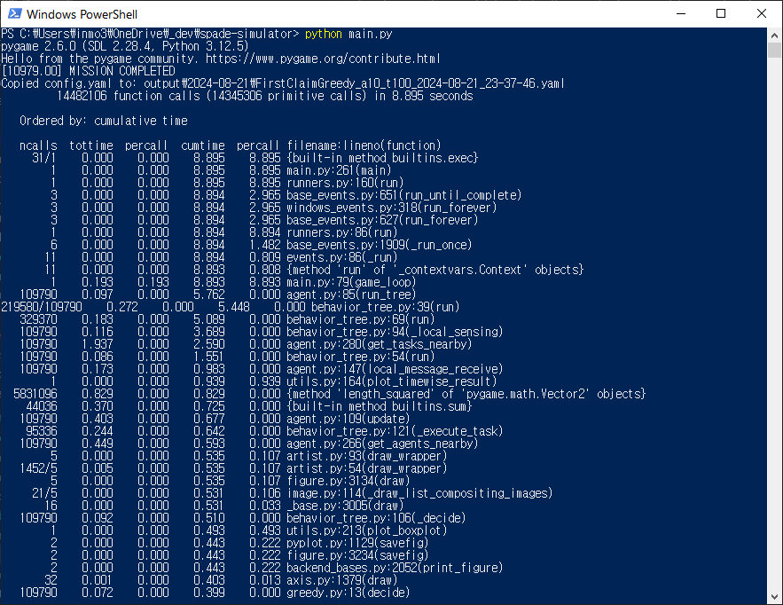

.. _tutorial_simulation_modes:

Simulation Modes
========================================

**Prerequisite**: :ref:`tutorial_basic_use`

.. contents:: Table of Contents

In this tutorial, we will explore key simulation parameter settings. This tutorial builds on the configuration file used in the :ref:`tutorial_basic_use`.

--------------------

Rendering Options
---------------------------------

You can adjust the rendering settings by modifying the following parameters (see :ref:`config_guide_simulation` for more details).

Basically, ``rendering_mode`` can be set to ``Screen``, ``Terminal``, or ``None``. All of the previous tutorials, we used ``Screen`` mode. 

In ``Screen`` mode, additional rendering options can be enabled, such as:

.. list-table::
   :widths: 50 30
   :header-rows: 0

   * - .. figure:: result/fig_sim_screen.png
         :width: 100%
         :align: center
         
         **Figure1:** Simulation Screen Example

     - .. code-block:: yaml

        simulation:
          sampling_freq: 1.0
          ....
          rendering_mode: Screen
          rendering_options:
            agent_tail: True
            agent_communication_topology: True
            agent_situation_awareness_circle: False
            agent_id: True
            agent_work_done: True
            agent_assigned_task_id: True
            agent_path_to_assigned_tasks: True
            task_id: False
         
         

In the above example, the ``agent_situation_awareness_circle`` option was not enabled. You can see how the screen is rendered when this option is activated in :ref:`tutorial_changing_local_sensing_range`.

.. warning::
    Enabling too many rendering options can place a heavy load on visualization rendering.

When ``rendering_mode`` is set to ``Terminal`` or ``None``, the terminal output will appear as follows. This mode is useful when you only need result files (e.g., for Monte Carlo testing purposes, see more details in :ref:`tutorial_monte_carlo`). 

.. list-table::
   :widths: 50 50
   :header-rows: 0

   * - .. figure:: result/fig_terminal_mode.png
         :width: 80%
         :align: center
         
         **Figure 2:** ``rendering_mode: Terminal``
     - .. figure:: result/fig_none_mode.png
         :width: 80%
         :align: center
         
         **Figure 3:** ``rendering_mode: None``

--------------------

Profiling Mode
---------------------------------

If you want to optimize computation during algorithm development, you can enable ``profiling_mode`` by setting it to ``True``.

.. code-block:: yaml

    simulation:
      profiling_mode: True

        **Figure 4:** ``profiling_mode: True``

By analyzing the output, you can evaluate the time consumed by each function. This feature is particularly useful when developing a custom decision-making plugin, allowing you to utilize it for optimization purposes.
